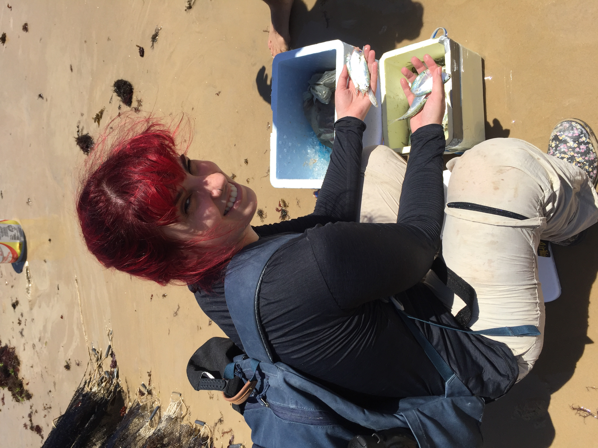
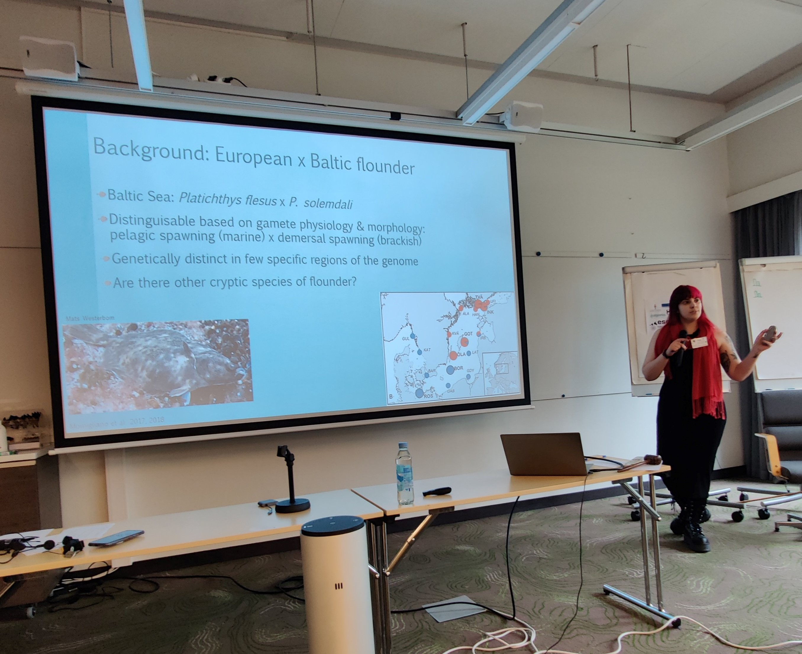
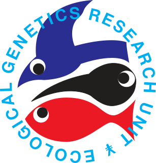

## Who am I?

I'm a Brazilian biologist, who is deeply fascinated by evolution. I got my bachelor degree in Biological Sciences from the Universidade Federal do Rio Grande do Norte, Brazil. During my undergrad studies, I had a range of different experiences as a intern in few labs, from detecting multiple parasites using PCR to investigating the phylogeography of fish and frogs. However, it were the fish who "hooked" me. My undergrad final project was about the phylogeography and species delimitation of the armored catfish *Pareiorhaphis garbei* from southeastern Brazil. I did this study as a member of the Laboratório de Ictiologia Sistemática e Evolutiva - LISE ([Lab Website](https://sites.google.com/view/liseufrn), in Portuguese) and under supervision of Prof. Dr. Sergio Maia Queiroz Lima ([ResearchGate](https://www.researchgate.net/profile/Sergio_Lima7)). For my master, I studied the ethnoichthyology and phylogeographic patterns of two clupeids (*Opisthonema oglinum* and *Harengula* sp.) in the Atlantic Ocean.

 

## Current Affairs

 

In the beginning of 2021, I started my PhD studies at the Doctoral Programme in Wildlife Biology (LUOVA) at the University of Helsinki. As a new member of the Ecological Genetics Research Unit (EGRU), my research project is about the speciation, adaptation, and ecology of the European flounder (*Platichthys flesus*) in Northern Europe. My supervisors are Prof. Juha Merilä, Dr. Paolo Momigliano, and Dr. Petri Kemppainen.
