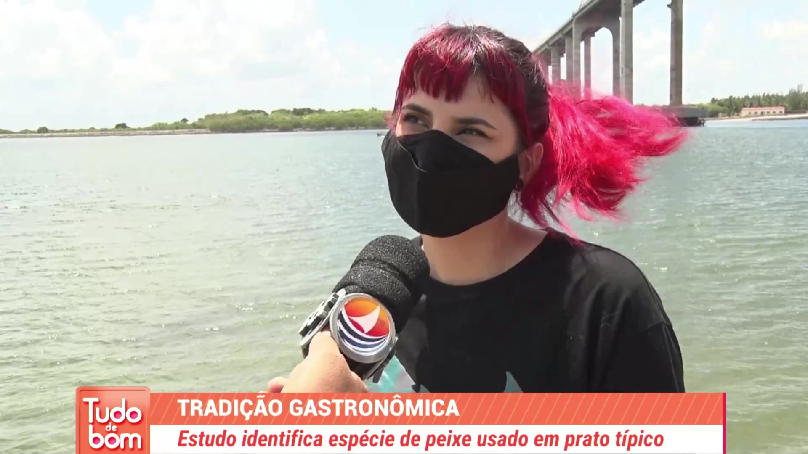
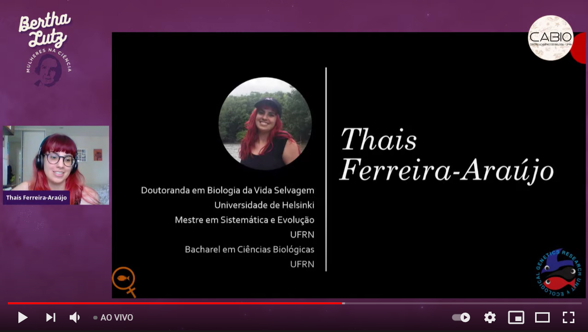

## Invited talks & interviews

 

### 2021

Interview to local news outlets about “ginga”, a culturally important herrings in northeastern Brazil.
[Researchers carry out investigation to define what is “ginga”](http://www.tribunadonorte.com.br/noticia/estudo-da-ufrn-desvenda-a-biologia-da-ginga/502841), [Unravelling the “Ginga”](https://nossaciencia.com.br/noticias/desvendando-a-ginga/) (in Portuguese)

 

Speaker on "IV Bertha Lutz: Women in Science" virtual event via Zoom, Universidade Federal do Rio Grande do Norte

 

### 2020

Moderator on "Biogeography Talk" virtual panel discussion with M. Dolores Casagrande via Zoom, Universidade Federal do Espírito Santo

 

Moderator on "Revitalization of aquatic environments: healing rivers and saving fish" virtual talk with Luisa Sarmento-Soares via Zoom, Universidade Federal do Espírito Santo